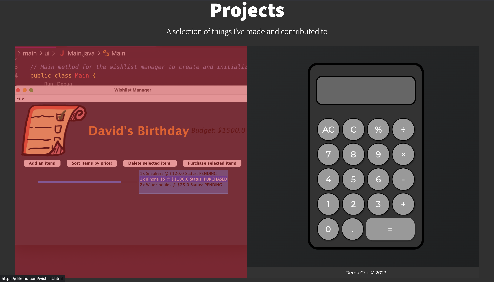

# Derek's Portfolio Site

## Table of Contents

- [Overview](#overview)
- [Demo](#demo)
- [Features](#features)
- [Technologies Used](#technologies-used)
- [Installation](#installation)
- [Usage](#usage)
- [Project Screenshots](#project-screenshots)

## Overview

This portfolio website is designed to give visitors an interactive way to view the projects that I've made and contributed. In addition, you can learn a bit more about me and what I like to do!

## Demo

You can visit my site live at [https://www.drkchu.com](https://www.drkchu.com).

## Features

- A dedicated "About Me" section to provide a brief introduction to my background and interests.
- Access to various social media profile located in the footer:
  - [Resume](files/DerekChuResume.pdf) (Hopefully current!)
  - [Medium](https://medium.com/@derekdbchu)
  - [GitHub](https://github.com/drkchu)
  - [LinkedIn](https://www.linkedin.com/in/drkchu)
  - [Email](mailto:derekdbchu@gmail.com)

- A clean and organized layout to make navigation easy for visitors.
- Links to my projects and a brief write-up covering the background for each project and the types of technology used

## Technologies Used

- HTML5
- CSS3 (including Flexbox and CSS Grid)
- JavaScript (for interactivity)
- DigitalOcean (Cloud infrastructure to host site)
- FileZilla (Open sourced FTP)

## Installation

1. Clone this repository to your local machine:

   ```bash
   git clone https://github.com/drkchu/derek-enterprise.git

## Usage
- Replace the placeholder content in the HTML and CSS files with your own information and project details.
- Customize the design and layout to match your personal style and branding.
- Add your project images, descriptions, and links to the portfolio section.
- Update the "About Me" section to provide a brief introduction to yourself.
- Modify the contact information to include your email address, LinkedIn profile, and other relevant details.
- Test the website locally to ensure everything works as expected.
- Deploy the website to your preferred hosting platform (e.g., GitHub Pages, Netlify, Vercel).

## Project Screenshots

<p align="center">
  
</p>

<p align="center">
  
</p>